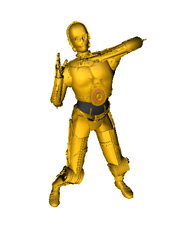

<h1>Hi there, i'm João Pedro Ribeiro </h1>

<pre >
    Developer  
    Computer Science Student  
</pre>

---

  
  

---

<h2>Skills and Tools</h2>

  

 

  <!-- Data Science -->
  
  
  
  
  

  <!-- Development & APIs -->
  
  
  
  

  <!-- Machine Learning -->
  
  
  

  <!-- Dashboards -->
  
  

  <!-- Scientific & Advanced -->
  
  
  

---

<h2>Contact</h2>

  
  
  

  
  

